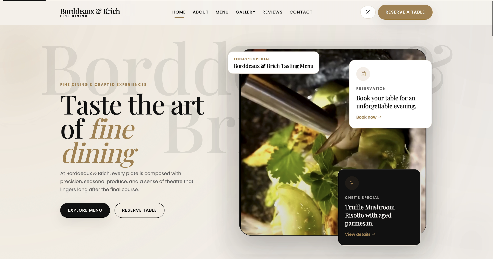
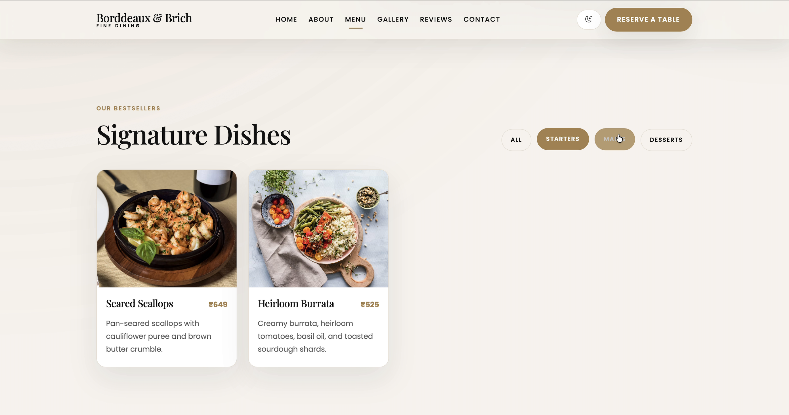
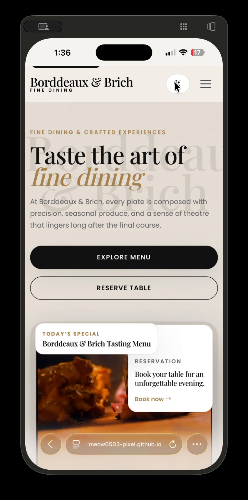

# Bordeaux & Birch Fine Dining

## Project Name
Bordeaux & Birch Fine Dining is a responsive single-page restaurant landing page with a warm, simple presentation and a strong focus on dinner service in Mumbai.

## Features
- Sticky responsive navbar with smooth scrolling and active section highlight
- Hero section with background video and JavaScript-powered daily special badge
- Filterable signature dishes menu grid
- Story-driven about section with highlight cards
- Clickable gallery with Bootstrap modal lightbox
- Testimonials carousel with star ratings
- Reservation form with inline JavaScript validation
- Contact details, embedded Google Map, and polished footer
- Optional dark mode toggle with `localStorage`

## Tech Stack
- HTML5
- CSS3
- JavaScript
- Bootstrap 5
- Bootstrap Icons
- Google Fonts: Playfair Display and Poppins

## Folder Structure
```text
.
├── index.html
├── README.md
├── css/
│   └── custom.css
├── js/
│   └── main.js
├── assets/
│   ├── images/
│   │   └── hero-poster.jpg
│   └── videos/
│       └── hero-dining-video.mp4
└── screenshots/
    ├── desktop-home.png
    ├── menu-section.png
    └── mobile-view.png
```

## How to Run Locally
1. Open the repository root folder.
2. Double-click `index.html`, or open it in any modern browser.
3. No build step or server is required.

## Screenshots

### Homepage - Desktop View



### Menu Section



### Mobile View


